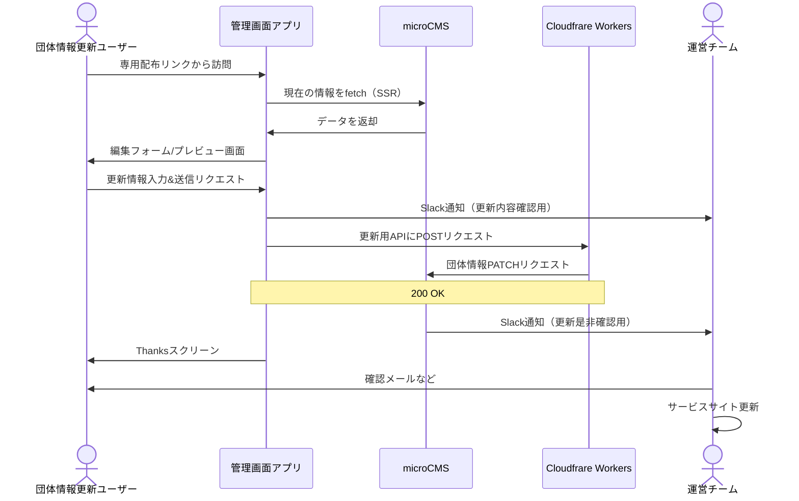

# 管理画面 を支える技術

基本的にはサービスサイトと同じ技術構成。管理画面だけで使っている、あるいは特に重宝している技術について書く。

## Slack Webhook

更新を通知する。クライアントと microCMS の 2 つから通知させる。クライアントからの通知は送信ボタンを押せば 100%来るが、microCMS からの通知は情報が更新された場合にしか来ない。

もしもクライアントから通知が来て microCMS 側から通知が来ていないときは、PATCH リクエストが失敗していることになるし、逆に microCMS 側からしか通知が来ないときは管理画面アプリ以外から情報の更新が行われたことになる。

## Sendgrid

メールアドレスが登録されていた場合に、更新時に確認メールを送信する。

## Cloudfrare Workers

PATCH リクエストを送れる API キーをクライアントサイドに晒すわけにはいかないので、そこらへんの処理をサーバーに押し込んでいる。

無料プランでは API キーが 1 つしか作れないので、microCMS との通信は SSR、SSG、クラウド環境などを利用して必ず隠匿すること。

## 更新フロー

