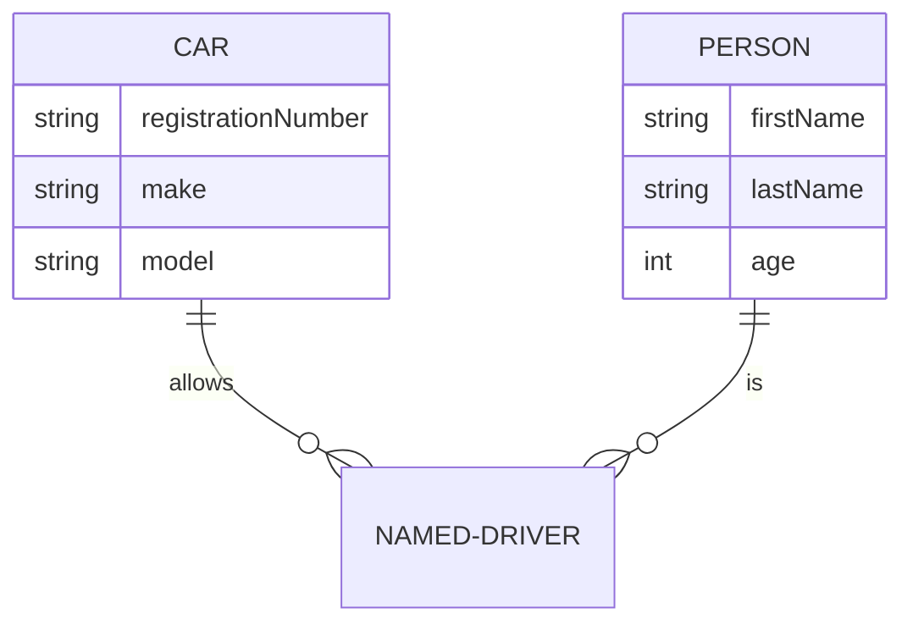

# Breeze について

## サービス概要

北海道大学の団体への独自インタビューを通して見えた彼らの世界観を語るブログのようなサービスです。1 つの企画は複数記事の連載から成ります。

<!-- 成し遂げたいことを書く -->

ざわめき...

## 関連ページ

<!-- TODO あとでちゃんと書く -->

| path | 内容 |
| ---- | ---- |
| /    | Top  |
| /    | ー   |
| /    | ー   |
| /    | ー   |
| /    | ー   |

## Breeze を支える技術

microCMS で管理しているコンテンツを API で取得し、Next.js SSG という技術で静的ページを生成。Cloudfrare Pages の CDN でキャッシングして高速に配信します。詳しくは[こちら](/about-dev/navi-ß)。

## 構造

TODO: ER 図

## 制作フロー
